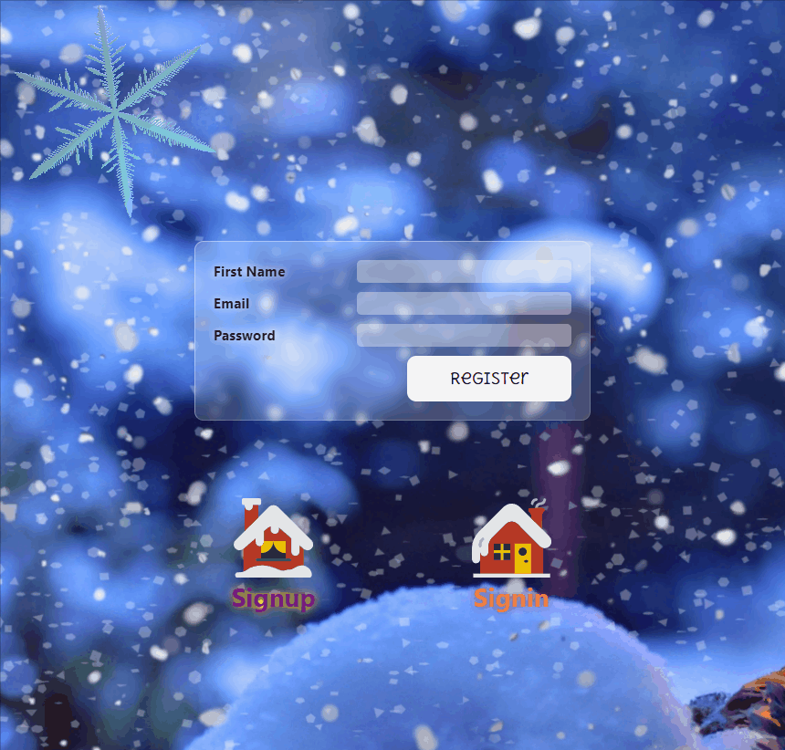
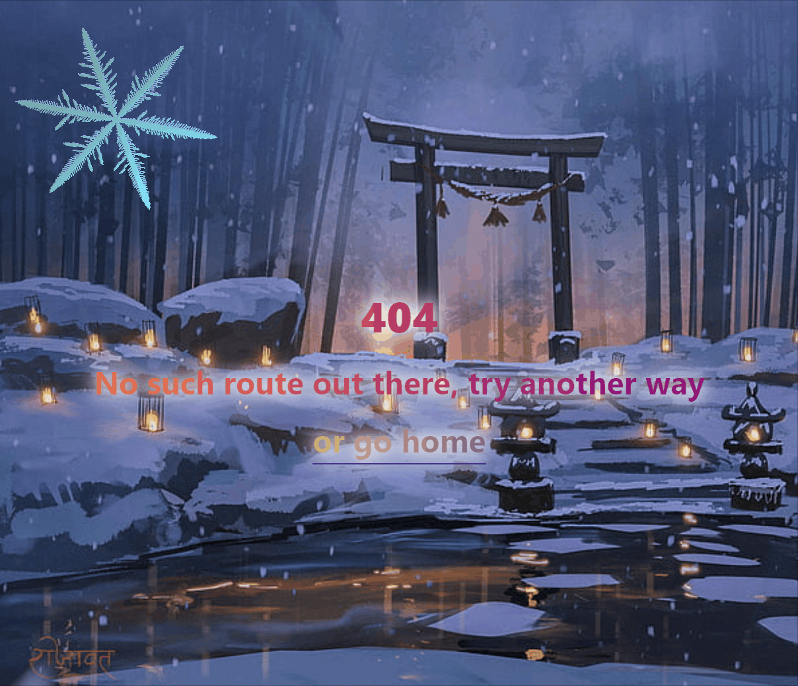

# Connections 

This project was generated with [Angular CLI](https://github.com/angular/angular-cli) version 17.0.7.

Task: https://github.com/rolling-scopes-school/tasks/tree/master/tasks/connections

## Deploy

**https://connections-gjh5.vercel.app/signup**

## Screenshots

## Development server

Run `ng serve` for a dev server. Navigate to `http://localhost:4200/`. The application will automatically reload if you change any of the source files.
