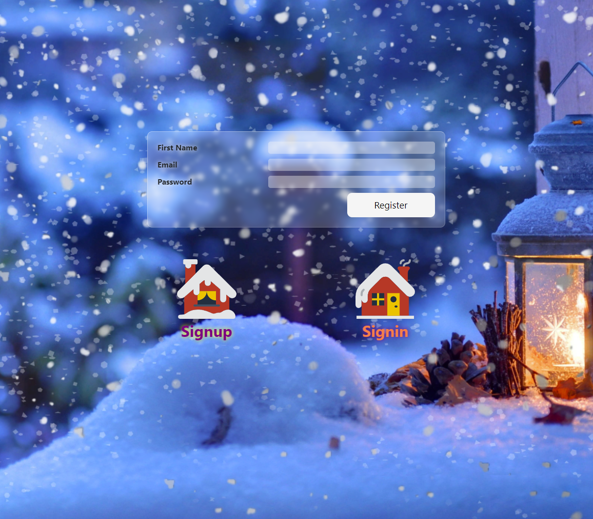

# Connections 

This project was generated with [Angular CLI](https://github.com/angular/angular-cli) version 17.0.7.

## Deploy

**https://connections-gjh5.vercel.app/signup**

## Development server

Run `ng serve` for a dev server. Navigate to `http://localhost:4200/`. The application will automatically reload if you change any of the source files.

## Code scaffolding

Run `ng generate component component-name` to generate a new component. You can also use `ng generate directive|pipe|service|class|guard|interface|enum|module`.
